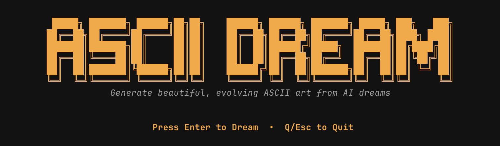
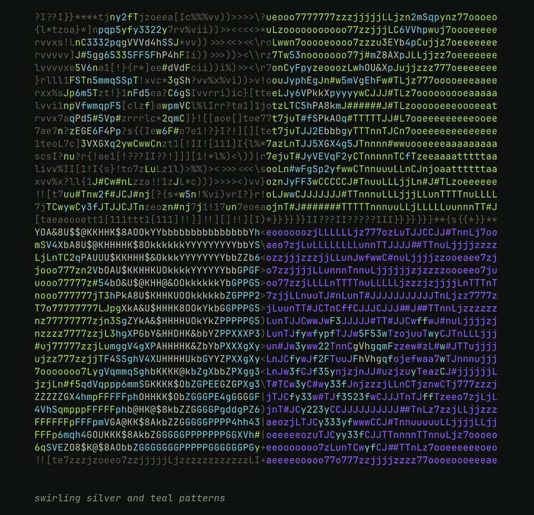

<p align="center">
  
</p>

<p align="center">
  <em>Appreciate it at full resolution in your terminal!</em>
</p>

<p align="center">
  
</p>

## Get Started

```bash
# Install ascii-dream
git clone https://github.com/will-marella/ascii-dream.git
cd ascii-dream
pip install -e .

# Create a modal account: https://modal.com/

# Install Modal and Authenticate
pip install modal
modal setup # (If that fails, try: python -m modal setup)
# Guide: https://modal.com/docs/guide

# Run it!
ascii-dream
```

## How It Works

- **Modal Backend** – Runs AI inference on GPU in the cloud (Modal manages infrastructure)
- **Prompt Evolution** – Intelligently varies prompts using templates with random color/element substitution
- **Image Queue** – Async producer-consumer that prefetches images while current ones display
- **ASCII Converter** – Transforms PIL images to colored ASCII art with smart width detection
- **TUI (Textual)** – Full interactive menu system with real-time generation display