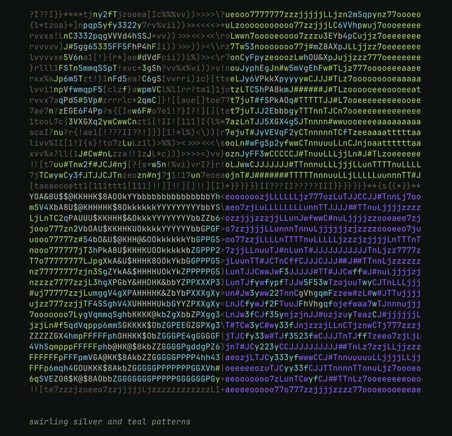

<p align="center">
  
</p>

<p align="center">
  <em>Appreciate it at full resolution in your terminal!</em>
</p>

<p align="center">
  
</p>

## Get Started

```bash
# Install from GitHub
pip install git+https://github.com/will-marella/ascii-dream.git

# Authenticate with Modal (one-time setup)
modal setup

# Run it!
ascii-dream
```

## Requirements

- Python 3.8+
- [Modal](https://modal.com) account (free) – Provides GPU access for AI generation, with generous usage limits


## How It Works

- **Modal Backend** – Runs AI inference on GPU in the cloud (Modal manages infrastructure)
- **Prompt Evolution** – Intelligently varies prompts using templates with random color/element substitution
- **Image Queue** – Async producer-consumer that prefetches images while current ones display
- **ASCII Converter** – Transforms PIL images to colored ASCII art with smart width detection
- **TUI (Textual)** – Full interactive menu system with real-time generation display

## License

MIT License – See LICENSE file for details.